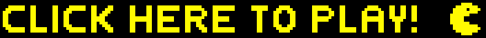

# Pac-Man API &nbsp; 

This repository is the backend server for my solo Pac-Man project. This API connects to both MongoDB and Redis databases to store and retrieve user account and score data respectively.

The client application that pairs with this API can be found at [https://github.com/jmcnally17/pacman-client](https://github.com/jmcnally17/pacman-client).

For the old Express API written in Javascript, see the old project repo found at [https://github.com/jmcnally17/pacman-API-old](https://github.com/jmcnally17/pacman-API-old).

### Technologies Used

- [Trello](https://trello.com/) for monitoring feature progress
- [Slim](https://www.slimframework.com/) as a web framework
- [Render](https://render.com/) for deployment
- [MongoDB Atlas](https://www.mongodb.com/atlas/database) and [Redis Labs](https://redis.com/) for hosting the databases
- [GitHub](https://github.com/) for version control

## Running Locally

This API can be run on your localhost in conjunction with the client application. However, a number of frameworks need to be installed which requires some setup to do.
